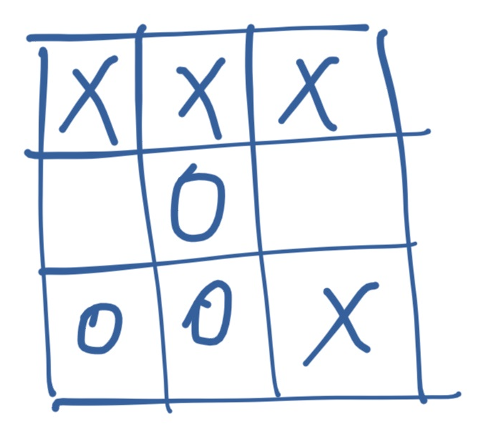
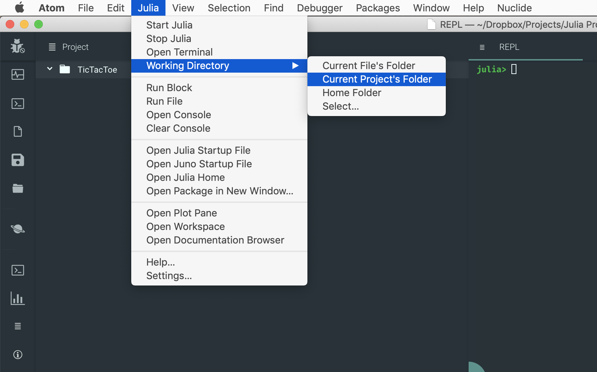
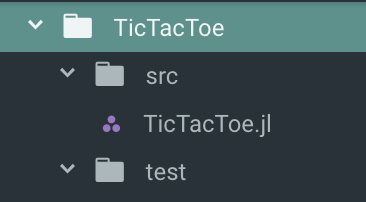

# Title

In this post I'm going to show you how to use Julia to develop a game of Tic-Tac-Toe. Tic-Tac-Toe is traditionally played with pen and paper, by two players, on a 3x3 square grid. One player is X and the other player is O. They both take turns placing their tokens on any empty board cell (X starts the game). The winner is the player which makes three in a row, either horizontally, vertically or diagonally. 



*Tic-Tac-Toe board with X winning the game (3 in a row horizontally, on the first row)*

#The Board

Let's start with the most obvious object in our game: the board. Julia has a perfect data structure for representing it: the `Matrix`. Something like: 

```julia
julia> [1 2 3; 4 5 6; 7 8 9]
3×3 Array{Int64,2}:
 1  2  3
 4  5  6
 7  8  9
```

Not bad. However, we'd like something which looks more like a proper game UI: 

```julia
┌─────┬───┬───┬───┐
│ Row │ A │ B │ C │
├─────┼───┼───┼───┤
│   1 │ X │   │ O │
├─────┼───┼───┼───┤
│   2 │   │   │   │
├─────┼───┼───┼───┤
│   3 │   │ O │ X │
└─────┴───┴───┴───┘
```

We'll define our own `Board` type, which will wrap a `Matrix`, but will use fancier rendering. Time to get coding! 

I'll use the Juno IDE but you can use whatever editor you want. However, we'll work with Julia files, which will be structured as a `Project`, so if you're planning on using a Jupyter notebook, that might not work too well. 

To start with, create a folder for our Project. I'm calling mine `TicTacToe/`. Open the folder in Juno and start a Julia console. Please make sure you set the working directory to "Curent Project's Folder":



*Juno's menu and and active Julia REPL.*

Next, let's create the project structure. The best practice is to create at least two extra folders: `src/` which hosts the Julia files, and `test/` which contains the tests. Let's have Julia create these for us: 

```julia
julia> mkdir("src")
julia> mkdir("test")
```

While we're at it, let's also create our main project file, `TicTacToe.jl`

```julia
julia> touch("src/TicTacToe.jl")
```

The file structure should look like this: 



Now that we're done with the housework, we can start coding. We want to define a `Board` type - which is made up of 9 individual `Cell` objects. Here's a first iteration, wrapping everything within the `TicTacToe` module: 

```julia
# src/TicTacToe.jl
module TicTacToe

export Board, Cell
export X, O, EMPTY

const X = 'X'
const O = 'O'
const EMPTY = ' '

struct Cell
  value::Char
end
Cell() = Cell(EMPTY)

struct Board
  data::Matrix{Cell}
end
Board() = Board([ Cell() Cell() Cell();
                  Cell() Cell() Cell();
                  Cell() Cell() Cell()
                ])

end
```

We define a `Cell` type which wraps a `Char`. We also define three constants, `X`, `O`, and `EMPTY` which map to the corresponding chars `'X'`, `'O'` and `' '`. We use the space char to represent an empty cell, that is, one which is neither X nor O. It's good practice to use constants instead of the actual values, as this does not tie our code to a fixed representation (we might want to use ❌ and ⭕️). We also define a default constructor for `Cell()` which creates an empty cell. 

As for `Board`, it wraps a `Matrix` of `Cell` - and also provides a 0 arguments `Board()` constructor which creates a 3x3 matrix of empty `Cell` objects. 

#### Rendering the board

Julia provides a series of functions for rendering values on the screen. Three of the most important ones are `display`, `show`, and `print`. I've listed them from the richest output to simplest. For example, for the char `'X'` we'll have the following representations: 

```julia
julia> display('X')
'X': ASCII/Unicode U+0058 (category Lu: Letter, uppercase)

julia> show('X')
'X'
julia> print('X')
X
```

Notice how `display` provides the fancies output, with lengthy details and a new line. While `show` is much simpler, focusing on the Julian representation (it shows the char as a Julia type, wrapped in `'`). Finally, `print` provides the simplest and most generic output, avoiding Julia specific details. We're going to overload the `Base.show` method, to provide pretty printing for our `Board` type. 

For formatting we'll use a package called `PrettyTables`. This provides pretty printing for arrays, so we can use it to format the `Board.data` matrix. 

We'll want to add this as a dependency for our project, so please go back to the REPL in Juno and type this: 

```julia
julia>] # enter Pkg mode
(v1.1) pkg> activate .
(TicTacToe) pkg> add PrettyTables
```

This will add the `PrettyTables` package to our project. In order make it available in our `TicTacToe` module, we need to declare that we're `using PrettyTables`. I also like to automatically activate the project's environment. Please update the `TicTacToe` module as follows: 

```julia
# src/TicTacToe.jl
using Pkg
pkg"activate ."

module TicTacToe

using PrettyTables

# ... rest of the code 

end
```

We're all set now. Our `show` method will invoke the `PrettyTables.pretty_table` function. Add this at the bottom of the `TicTacToe` module: 

```julia
export A, B, C

const A = 'A'
const B = 'B'
const C = 'C'

Base.show(io::IO, board::Board) = pretty_table(board.data, 
  																							[A, B, C], 
  																							hlines = [1,2], 
  																							show_row_number = true)
```

The code defines a new `show` method for displaying `Board` types. The method uses the `pretty_table` function to render the `Board.data` matrix, using the `A`, `B`, `C` labels for columns, adding horizontal lines between rows `1` and `2` and row numbers. 

Now, to sort out the rendering of the `Cell`. Add this under the previous `show` declaration: 

```julia
Base.show(io::IO, cell::Cell) = print(io, cell.value)
```

We're simply saying that `show` should use the same unformatted char value as `print`, resulting in the actual letter, no quotes or anything. 

If we reload the module and create a new board, we'll see the formatting in action: 

```julia
julia> include("src/TicTacToe.jl")
julia> using .TicTacToe
julia> board = Board()
┌─────┬───┬───┬───┐
│ Row │ A │ B │ C │
├─────┼───┼───┼───┤
│   1 │   │   │   │
├─────┼───┼───┼───┤
│   2 │   │   │   │
├─────┼───┼───┼───┤
│   3 │   │   │   │
└─────┴───┴───┴───┘
```

## Making some moves

Now that we can render the gameboard, it's time to add the logic for placing the Xs and Os. We'll define the `at` function which retrieves the cell _at_ a certain pair of coordinates, for example the cell at B,2 which is the center of the board. We'll also add the matching `at!` function which will be used for setting a cell's value. The first iteration looks like this: 

```julia
const labels = Dict{Char,Int}(A => 1, B => 2, C => 3)

function at(board::Board, coords::Pair{Char,Int}) :: Cell
  board.data[coords[2], labels[coords[1]]]
end

function at!(board::Board, value::Char, coords::Pair{Char,Int}) :: Board
  cell = Cell(value)
  board.data[coords[2], labels[coords[1]]] = cell
  board
end
```

The functions are invoked as follows - getting or, respectively, setting, the corresponding cells:

```julia
julia> at!(board, X, B=>2) # place X at column B row 2
┌─────┬───┬───┬───┐
│ Row │ A │ B │ C │
├─────┼───┼───┼───┤
│   1 │   │   │   │
├─────┼───┼───┼───┤
│   2 │   │ X │   │
├─────┼───┼───┼───┤
│   3 │   │   │   │
└─────┴───┴───┴───┘
julia> at(board, B=>2) # get the value at column B row 2
X
```


### Always be testing

We've gone far enough with the development - it's time to add some tests before things get too complicated. Please create a `runtests.jl` file inside the `test/` folder: 

```julia
julia> touch("test/runtests.jl")
```

We can start by adding tests for creating an empty board - then setting and getting a cell: 

```julia
# test/runtests.jl
using Test
include("../src/TicTacToe.jl")
using .TicTacToe

@testset "Board and cells" begin
  board = Board()
  @test at(board, A=>1).value == EMPTY # cell should be empty

  at!(board, X, A=>1) # set A1 to X
  @test at(board, A=>1).value == X # value at A1 should be X
end
```

The tests can be run by simply including the file: 

```julia
julia> include("test/runtests.jl")
Test Summary:   | Pass  Total
Board and cells |    2      2
```

That looks great, but what if somebody would try to pass an invalid value, something other than X or O? 

```julia
at!(board, 'Z', A=>3) # this should fail but it doesn't
@test at(board, A=>3).value == 'Z' # the test passes, we have a Z on our board
```

Our program is very gullable at this point and happily allows illegal moves. 

#### Internal constructors

In order to address this problem we need to control how new cells are created. For this we can define an internal constructor. These are special, in that all the external constructors automatically invoke the internal one. So if we define restrictions here, it will be impossible to create illegal cells. Update the `Cell` constructor to look like this: 

```julia
# src/TicTacToe.jl
export InvalidValueException

abstract type TicTacToeException <: Exception end

struct InvalidValueException <: TicTacToeException
  value::Char
end

struct Cell
  value::Char

  function Cell(v::Char)
    in(v, [X, O, ' ']) && return new(v)
    InvalidValueException(v) |> throw
  end
end
```

The internal constructor checks that only legal values are used - otherwise a custom `InvalidValueException` exception is thrown. Now the test will fail - so we need to replace it with a `@test_throws` type of test, to make it pass: 

```julia
# test/runtests.jl
@test_throws InvalidValueException at!(board, 'Z', A=>3) # our code correctly errors out
```

But what if a player will try to place her peg on top of an already taken cell? Or try to make multiple moves? We can foolproof our code by making the `at` and `at!` functions more robust: 

```julia
# src/TicTacToe.jl
export InvalidMoveException, InvalidCoordinatesException

struct InvalidMoveException <: TicTacToeException
  msg::String
end

struct InvalidCoordinatesException <: TicTacToeException
  col::Char
  row::Int
end

function at(board::Board, coords::Pair{Char,Int}) :: Cell
  if ! isvalidcolumn(coords[1]) || ! isvalidrow(coords[2])
    InvalidCoordinatesException(coords[1], coords[2]) |> throw
  end

  board.data[coords[2], labels[coords[1]]]
end

function at!(board::Board, value::Char, coords::Pair{Char,Int}) :: Board
  cell = Cell(value)

  current_value = at(board, coords)
  isemptycell(current_value) && isvalidvalue(cell) && 
  	isvalidsequence(board, cell) || 
  		InvalidMoveException("Cell already contains a value $current_value") |> throw

  board.data[coords[2], labels[coords[1]]] = cell
  board
end

function cells(board::Board) :: Base.Generator
  (c for c in board.data)
end

isemptycell(cell::Cell)::Bool = isempty(strip(string(cell.value)))
isvalidcolumn(value::Char)::Bool = in(value, keys(labels))
isvalidrow(value::Int)::Bool = 0 < value <= 3
isvalidvalue(cell::Cell)::Bool = in(cell.value, [X, O])

function isvalidsequence(board::Board, cell::Cell) :: Bool
  isemptycell(cell) && InvalidMoveException("Can only choose X or O") |> throw

  Xs = Os = 0
  for c in cells(board)
    if c.value == X
      Xs += 1
    elseif c.value == O
      Os += 1
    end
  end

  (Xs == Os && cell.value == X) || (Xs == Os + 1 && cell.value == O) ?
    true :
    throw(InvalidMoveException("Invalid move sequence $(cell.value)"))
end
```

Now both `at` and `at!` perform validation on their inputs, ensuring that the coordinates are valid, the cell is empty, the passed value is legal, and the move sequence is correct. We define a series of utility functions to perform these validations - as well as the correspoding types of exceptions. 

And our updated tests: 

```julia
# test/runtests.jl
using Test
include("../src/TicTacToe.jl")
using .TicTacToe

@testset "Board and cells" begin
  board = Board()
  @test at(board, A=>1).value == EMPTY

  at!(board, X, A=>1)
  @test at(board, A=>2).value == X

  at!(board, O, A=>2)
  @test at(board, A=>2).value == O

  @test_throws InvalidValueException at!(board, 'Z', A=>3)

  @test_throws InvalidCoordinatesException at(board, C=>4)
  @test_throws InvalidCoordinatesException at!(board, O, C=>4)

  @test_throws InvalidMoveException at!(board, X, A=>2)
  @test_throws InvalidMoveException at!(board, X, A=>1)
  @test_throws InvalidMoveException at!(board, ' ', A=>3)
end
```

All tests are passing: 

```julia
julia> include("test/runtests.jl")
Test Summary:   | Pass  Total
Board and cells |    9      9
```

## Get your game on

We've done great: our game is robust and cheaters won't stand a chance to trick it. However, two important pieces of logic are still missing: checking if a game is over (either by winning or by draw) and playing a game. 

We said that victory is achieved by placing three of the same peg in a **row**, **column**, or **diagonal**. These are key concepts and it would be useful to access them through functions which return the corresponding collections of cells. This is the code to be added to the `TicTacToe` module: 

```julia
# src/TicTacToe.jl
function rows(board::Board) :: Vector{Vector{Cell}}
  result = Vector{Vector{Cell}}()
  for x in 1:3
    push!(result, board.data[x,:])
  end

  result
end

function columns(board::Board) :: Vector{Vector{Cell}}
  result = Vector{Vector{Cell}}()
  for x in 1:3
    push!(result, board.data[:,x])
  end

  result
end

function diagonals(board::Board) :: Vector{Vector{Cell}}
  result = Vector{Vector{Cell}}()
  push!(result, Cell[board.data[1,1], board.data[2,2], board.data[3,3]])
  push!(result, Cell[board.data[1,3], board.data[2,2], board.data[3,1]])

  result
end
```

Now we can use these to implement the final pieces: 

```julia
import Base: ==
export isover, new

==(a::Cell, b::Cell) = a.value == b.value
Base.hash(cell::Cell) = hash(cell.value)

function isover(board::Board) :: NamedTuple{(:status,:winner),Tuple{Bool,Char}}
  for c in TicTacToe.columns(board)
    c[1] == c[2] == c[3] && c[1] != Cell(EMPTY) && 
    	return (status = true, winner = c[1].value)
  end
  for r in TicTacToe.rows(board)
    r[1] == r[2] == r[3] && r[1] != Cell(EMPTY) && 
    	return (status = true, winner = r[1].value)
  end
  for d in TicTacToe.diagonals(board)
    d[1] == d[2] == d[3] && d[1] != Cell(EMPTY) && 
    	return (status = true, winner = d[1].value)
  end

  isempty(filter(TicTacToe.isemptycell, board.data)) && 
  	return (status = true, winner = EMPTY)

  (status = false, winner = EMPTY)
end

function new()
  upcoming_move = X
  board = Board()

  while ! isover(board).status
    println("Your move, $upcoming_move")
    show(board)

    move = readline() |> uppercase |> strip
    try
      at!(board, upcoming_move, Pair(move[1], parse(Int, move[2])))
      upcoming_move = upcoming_move == X ? O : X
    catch ex
      println(ex)
    end
  end

  println("Game over!")
  status = isover(board)
  if in(status.winner, [X, O])
    println("Congratulations $(status.winner)")
  else
    println("Draw")
  end

  show(board)
end
```

The `isover` function iterates over the collections of columns, rows, and diagonals and for each one checks if all the cells have the same non-empty value. If yes, we have a winner. If there's no winner, it checks if the board is full. If there are no empty cells, it's a draw. For any other case, the game is still on. In order to make cell comparison cleaner, we overloaded the `==` operator, making it work for cell objects. 

The `new` function starts the main game loop, asking for alternating moves and displaying the status of the game once it's over. 

Time to play!

```julia
julia> include("src/TicTacToe.jl")
julia> using .TicTacToe
julia> new()
Your move, X
┌─────┬───┬───┬───┐
│ Row │ A │ B │ C │
├─────┼───┼───┼───┤
│   1 │   │   │   │
├─────┼───┼───┼───┤
│   2 │   │   │   │
├─────┼───┼───┼───┤
│   3 │   │   │   │
└─────┴───┴───┴───┘
A1
Your move, O
┌─────┬───┬───┬───┐
│ Row │ A │ B │ C │
├─────┼───┼───┼───┤
│   1 │ X │   │   │
├─────┼───┼───┼───┤
│   2 │   │   │   │
├─────┼───┼───┼───┤
│   3 │   │   │   │
└─────┴───┴───┴───┘
B2
Your move, X
┌─────┬───┬───┬───┐
│ Row │ A │ B │ C │
├─────┼───┼───┼───┤
│   1 │ X │   │   │
├─────┼───┼───┼───┤
│   2 │   │ O │   │
├─────┼───┼───┼───┤
│   3 │   │   │   │
└─────┴───┴───┴───┘
```

## What's next? 


You can further improve your Julia skills by enhancing the rendering of the board, for example by adding logic to display X in blue and O in red, and to display a winning series of 3 using green. 

Follow me on Twitter @essenciary https://twitter.com/essenciary to be notified about the upcoming chapters in our sequel. In the second part we'll build a smart Tic-Tac-Toe agent using Julia and we'll play against it. In the third, we'll publish our game on the internet, as a web app, allowing remote users to play against our bot. Finally, in the 4th part, we'll construct a neural network and we'll train it using adversarial  reinforcement learning provided by our Tic-Tac-Toe bot. See you soon! 